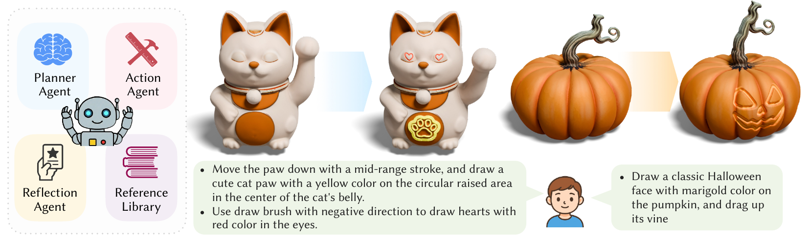
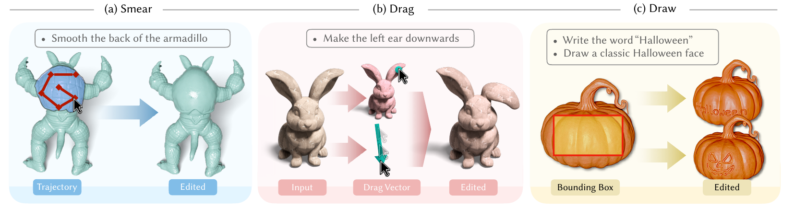
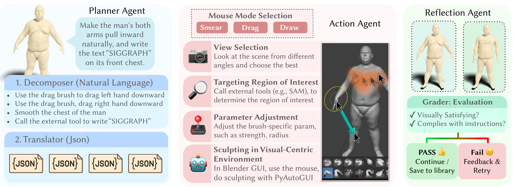

<div align="center">

# ViSculpt: Visual-Centric Agentic Geometry Editing

<a href="https://arxiv.org/abs/2608.24169"></a>

Bo Pang∗, Jiaqi Pan∗, Xiaocheng Zhang, Jiacheng Xu, Guoping Wang†, Peng-Shuai Wang†

<a href="asset/teaser.pdf">
  
</a>

<a href="asset/three_primitives.pdf">
  
</a>

<a href="asset/example_pipeline.pdf">
  
</a>

<a href="asset/experiment_samples.pdf">
  
</a>

</div>


## Requirements

- Windows 10/11 or macOS 13 or newer
- [Git](https://git-scm.com/)
- [uv](https://docs.astral.sh/uv/)
- [Node.js](https://nodejs.org/) 20.9 or newer with npm
- [Blender](https://www.blender.org/download/) 5.1 or 5.2
- Python 3.13, automatically downloaded and managed by `uv`
- A supported LLM/VLM endpoint and API key when that endpoint requires one

## Installation

Configure the main ViSculpt environment and build the Web app:

```bash
uv run visculpt setup
```

Configure the isolated SAM 3 environment:

```bash
uv run visculpt setup-sam3
```

Build and install the Blender Add-on:

```bash
uv run visculpt install-addon
```

If Blender is not discovered automatically, set `BLENDER_EXECUTABLE` or use
`uv run visculpt install-addon --blender /path/to/blender`.

## Configure the LLM/VLM before the first start

`uv run visculpt setup` creates an ignored `.env` file. The bundled
[configuration](src/visculpt/workflow/default_config.toml) uses the Gemini
OpenAI-compatible API and the `gemini-3.7-flash` model by default. Add a valid
Gemini key before running ViSculpt:

```dotenv
GEMINI_API_KEY=your-gemini-api-key
```

The default Agent Server cannot start when `GEMINI_API_KEY` is missing from
both `.env` and the process environment.

<details>
<summary><strong>Use another API on the first start (optional)</strong></summary>

To use another API on the first start, edit the active `[llm]` and
`[llm.models]` sections in
[`default_config.toml`](src/visculpt/workflow/default_config.toml) before
running `uv run visculpt start`.

Use the following connection values:

| API | `provider` | `base_url` | `endpoint_path` | `api_key_env` | `api_key_mode` | `schema_profile` |
| --- | --- | --- | --- | --- | --- | --- |
| Gemini | `openai_compatible` | `https://generativelanguage.googleapis.com` | `/v1beta/openai/chat/completions` | `GEMINI_API_KEY` | `required` | `gemini_compatible` |
| LM Studio | `openai_compatible` | `http://127.0.0.1:1234` | `/v1/chat/completions` | `LMSTUDIO_API_KEY` | `if_present` | `full` |
| Qwen, OpenAI-compatible | `openai_compatible` | `https://dashscope.aliyuncs.com` | `/compatible-mode/v1/chat/completions` | `DASHSCOPE_API_KEY` | `required` | `full` |
| Qwen, Anthropic-compatible | `anthropic` | `https://dashscope.aliyuncs.com` | `/apps/anthropic/v1/messages` | `DASHSCOPE_API_KEY` | `required` | `full` |
| xAI | `openai_compatible` | `https://api.x.ai` | `/v1/chat/completions` | `XAI_API_KEY` | `required` | `full` |

For example, for an unauthenticated local LM Studio server, change these
fields in the existing `[llm]` section and keep its remaining timeout and
retry settings:

```toml
[llm]
provider = "openai_compatible"
base_url = "http://127.0.0.1:1234"
endpoint_path = "/v1/chat/completions"
api_key_env = "LMSTUDIO_API_KEY"
api_key_mode = "if_present"
schema_profile = "full"
```

Leave `LMSTUDIO_API_KEY` empty unless the local server requires it. For Qwen,
xAI, or an authenticated LM Studio server, place the corresponding key in
`.env`:

```dotenv
LMSTUDIO_API_KEY=your-lm-studio-api-key
DASHSCOPE_API_KEY=your-dashscope-api-key
XAI_API_KEY=your-xai-api-key
```

For any other OpenAI-compatible or Anthropic-compatible service, configure its
Base URL and endpoint path, set `api_key_env = "CUSTOM_API_KEY"`, and choose
`api_key_mode = "required"` when authentication is mandatory or
`api_key_mode = "if_present"` when it is optional. Put the credential only in
`.env`; leave it empty only when the endpoint accepts unauthenticated requests:

```dotenv
CUSTOM_API_KEY=your-custom-api-key
```

Set every entry under `[llm.models]` to a model ID exposed by the selected
service:

```toml
[llm.models]
decomposer = "your-model-id"
translator = "your-model-id"
view_selector = "your-model-id"
quadloc = "your-model-id"
svg_pattern_generator = "your-model-id"
grader = "your-model-id"
retry_planner = "your-model-id"
```

If the endpoint does not support reasoning effort, set `effort = ""` in the
`[llm]` section. After the Web app becomes available, Settings can test and
persist later API changes.

</details>

## Enable the Blender Add-on

In Blender, open `Edit > Preferences > Extensions` and enable
**Geometry Editing RPC**. Its loopback server starts automatically by default.

<details>
<summary><strong>Change the Add-on listening port (optional)</strong></summary>

The Add-on's RPC Server listens on port `8765` by default. If that port is
unavailable, open the **Geometry Editing RPC** settings in Blender Preferences
and change the port to an available value. Then update
[`default_config.toml`](src/visculpt/workflow/default_config.toml) so
`services.blender_rpc_url` uses the same port before starting ViSculpt again.
For example, when using port `18765`:

```toml
[services]
blender_rpc_url = "http://127.0.0.1:18765/rpc"
```

</details>

## Run ViSculpt

Open Blender, load a mesh, and keep the Geometry Editing RPC Add-on enabled.
Then start the Agent Server, Web app, and SAM 3 service together:

```bash
uv run visculpt start
```

ViSculpt waits for all services and opens <http://127.0.0.1:3000> in the default browser.

## Demo Examples

Import one of the bundled OBJ models into Blender, and run the corresponding instructions in ViSculpt. 


Model: [lucky cat.obj](<demo/models/lucky cat.obj>)

- `Carve a heart emoji on both eyes`
- `Pull the left paw downwards`
- `Draw a cat paw pattern on the round raised area on the belly`
- `Make the ears longer`

Model: [pumpkin.obj](demo/models/pumpkin.obj)

- `Carve a classic halloween face without the circular border on the pumpkin's body`

Model: [armadillo.obj](demo/models/armadillo.obj)

- `Smooth the shell`
- `Wave the arms downwards`
- `Smooth the torso and draw a star emoji on the belly`

Model: [fox.obj](demo/models/fox.obj)

- `Pull the arms upwards`
- `Smooth the torso and draw a moon pattern on the chest`

## Privacy

Blender RPC, SAM 3, the Agent Server, and the Web app bind to loopback
addresses by default. Instructions and screenshots are sent to the configured
LLM/VLM provider, so review that provider's privacy policy before use. Secrets
remain in the ignored `.env` file and are never exposed to browser JavaScript.

## Acknowledgements

This repository includes an inference-focused derivative of Meta's official
[SAM 3](https://github.com/facebookresearch/sam3) implementation. See its
bundled [SAM License](dependencies/sam3-inference-service/LICENSE). Blender is
a trademark of the Blender Foundation and is not affiliated with this project.

## Citation

```bibtex
@article{pang2026visculpt,
  title   = {ViSculpt: Visual-Centric Agentic Geometry Editing},
  author  = {Bo Pang and Jiaqi Pan and Xiaocheng Zhang and Jiacheng Xu and Guoping Wang and Peng-Shuai Wang},
  journal = {arXiv preprint arXiv:2608.24169},
  year    = {2026}
}
```
